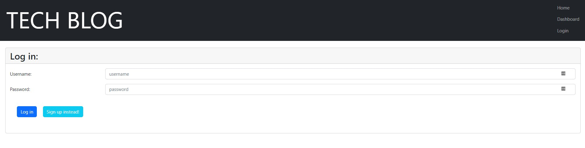

# Tech Blog


## Description

- Challenge Assignment for University of Wisconsin Extended Campus Coding Bootcamp
- This application allows users to view and comment on blog pots, as well as publish posts of their own.

## Table of Contents

- [User Story](#user-story)
- [Installation](#installation)
- [Preview](#preview)
- [Deployed Application](#deployed-application)
- [License](#license)
- [Questions](#questions)

## User Story
```md
GIVEN a CMS-style blog site
WHEN I click on the sign-up button
THEN my user credentials are saved and I am logged into the site
WHEN I revisit the site at a later time and choose to sign in
THEN I am prompted to enter my username and password
WHEN I am signed in to the site
THEN I see navigation links for the homepage, the dashboard, and the option to log out
WHEN I click on the homepage option in the navigation
THEN I am taken to the homepage and presented with existing blog posts that include the post title and the date created
WHEN I click on an existing blog post
THEN I am presented with the post title, contents, post creator’s username, and date created for that post and have the option to leave a comment
WHEN I enter a comment and click on the submit button while signed in
THEN the comment is saved and the post is updated to display the comment, the comment creator’s username, and the date created
WHEN I click on the dashboard option in the navigation
THEN I am taken to the dashboard and presented with any blog posts I have already created and the option to add a new blog post
WHEN I click on the button to add a new blog post
THEN I am prompted to enter both a title and contents for my blog post
WHEN I click on the button to create a new blog post
THEN the title and contents of my post are saved and I am taken back to an updated dashboard with my new blog post
WHEN I click on one of my existing posts in the dashboard
THEN I am able to delete or update my post and taken back to an updated dashboard
WHEN I click on the logout option in the navigation
THEN I am signed out of the site
WHEN I am idle on the site for more than a set time
THEN I am able to view comments but I am prompted to log in again before I can add, update, or delete comments
```
## Installation

To run application on local server: 
<br />
- Run `npm install` at the root of the project
- Enter the MYSQL Shell and run `source db/schema.sql;` to initialize the database
- Create a .env file and add the following information:
  - DB_NAME=ecommerce_db
  - DB_USER='your MYSQL username'
  - DB_PW='your MYSQL password'
- In the root of the project, run `npm run seed` to seed the database
- Run `npm start` or `node server.js` to start the server

## Preview:

The following images demonstrate the Tech Blog's appearance and functionality:





## Deployed Application

Click [here](https://carolyn-tech-blog.herokuapp.com/) to view the deployed applicaiton on Heroku.

## License

This application is licensed under MIT.

## Questions

If you have any questions about this project please email me directly at [cghudson@uwalumni.com](mailto:cghudson@uwalumni.com) .

View more of my projects on [GitHub](https://github.com/cghudson).
